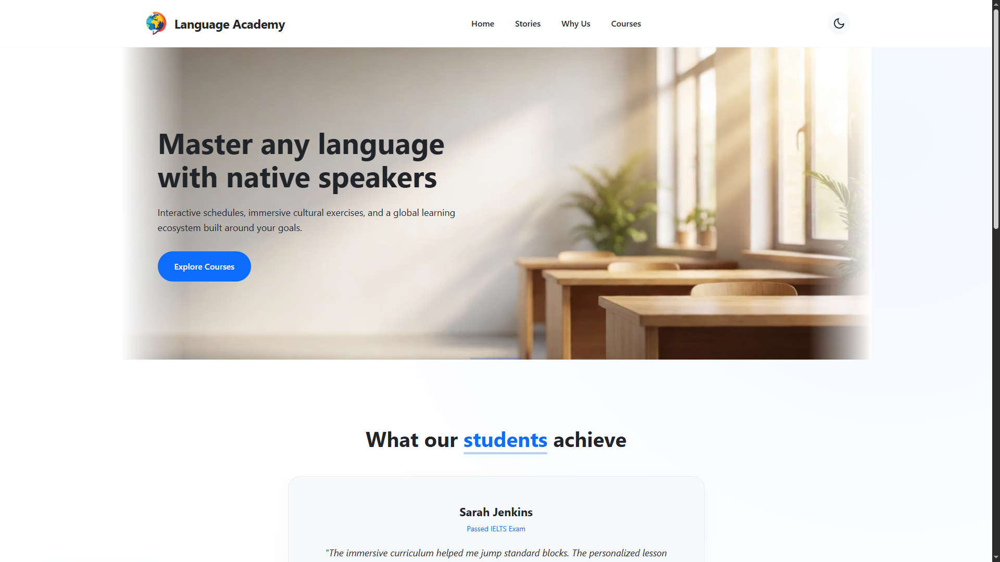
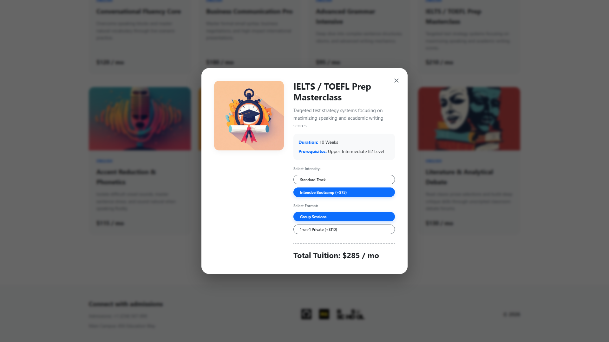

# [Landing Page](https://github.com/rolling-scopes-school/tasks/blob/master/fullstack-engineering/tasks/landing-page/README.md)

## 1.1. Task: [Landing Page. Часть 1: Вёрстка](https://github.com/rolling-scopes-school/tasks/blob/master/fullstack-engineering/tasks/landing-page/README-part-1.md)
## 1.2. Screenshot:

## 1.3. Deployment: https://yauheni-silkou.github.io/landing-page/language-academy/index.html
## 1.4. Done 22.09.2026 / deadline 22.09.2026
## 1.5. Score: 100 / 100

- Страницы и навигация (10/10)
  - [x] Реализованы главная страница и каталог с разными URL (4)
  - [x] С каждой страницы можно перейти на другую, логотип или название проекта ведёт на главную страницу (2)
  - [x] Навигация содержит ссылки на основные секции главной страницы и страницу каталога. При переходе по якорным ссылкам в пределах одной страницы используется плавная прокрутка (2)
  - [x] На каждой странице подключён favicon (2)
- Обязательные элементы (25/25)
  - [x] На обеих страницах есть единообразный header, содержащий логотип или название проекта, навигацию и переключатель темы (5)
  - [x] На главной странице есть не менее четырёх контентных секций (4)
  - [x] Реализована hero-секция с заголовком, основной информацией о проекте и целевым действием (3)
  - [x] На главной странице есть секция со слайдером или каруселью минимум из трёх элементов и элементами управления (3)
  - [x] На странице каталога предусмотрено не менее трёх категорий и элементы управления для их переключения (3)
  - [x] В одной из категорий представлено не менее восьми карточек, содержащих изображение, заголовок, краткое описание и дополнительную информацию (3)
  - [x] Для отображения дополнительных карточек предусмотрена кнопка показа оставшихся карточек или пагинация (2)
  - [x] На обеих страницах есть единообразный footer, содержащий контактную информацию, внешние ссылки и дополнительную информацию о проекте (2)
- Визуальное оформление (18/18)
  - [x] Главная страница соответствует требованиям к визуальному оформлению на ширине 1440px (3)
  - [x] Страница каталога соответствует требованиям к визуальному оформлению на ширине 1440px (3)
  - [x] Главная страница соответствует требованиям к визуальному оформлению на ширине 768px (3)
  - [x] Страница каталога соответствует требованиям к визуальному оформлению на ширине 768px (3)
  - [x] Главная страница соответствует требованиям к визуальному оформлению на ширине 380px (3)
  - [x] Страница каталога соответствует требованиям к визуальному оформлению на ширине 380px (3)
- Адаптивность (15/15)
  - [x] При плавном изменении ширины экрана от 1440px до 768px на обеих страницах отсутствует горизонтальная прокрутка, элементы не перекрываются и не выходят за границы экрана, контент не обрезается (5)
  - [x] При плавном изменении ширины экрана от 768px до 380px на обеих страницах отсутствует горизонтальная прокрутка, элементы не перекрываются и не выходят за границы экрана, контент не обрезается (5)
  - [x] Изображения сохраняют пропорции, элементы адаптируют размеры и расположение без масштабирования всей страницы, фон занимает всю доступную ширину (3)
  - [x] На ширине 768px и меньше основная навигация скрыта и отображается кнопка бургер-меню (2)
- Светлая и тёмная темы (17/17)
  - [x] Светлая и тёмная темы применяются ко всем секциям обеих страниц (4)
  - [x] Переключатель работает на обеих страницах и изменяет активную тему (4)
  - [x] Выбранная тема сохраняется в localStorage и восстанавливается после перезагрузки страницы (3)
  - [x] Выбранная тема сохраняется при переходе между страницами (2)
  - [x] Состояние переключателя соответствует активной теме (2)
  - [x] В обеих темах сохранены читаемость, достаточный контраст и единый визуальный стиль (2)
- Валидность, семантика и доступность (10/10)
  - [x] Главная страница проходит проверку W3C Validator без ошибок (2)
  - [x] Страница каталога проходит проверку W3C Validator без ошибок (2)
  - [x] Семантические элементы header, nav, main, section, footer используются по назначению (2)
  - [x] На каждой странице используется только один h1, заголовки не нарушают логическую иерахию (2)
  - [x] У значимых изображений заполнен осмысленный атрибут alt, декоративные изображения корректно скрыты от скринридеров (2)
- Ссылки и интерактивные состояния (5/5)
  - [x] Контактные и внешние ссылки выполняют ожидаемое действие (2)
  - [x] Ссылки, кнопки и карточки имеют состояние hover (2)
  - [x] Изменение внешнего вида элементов происходит плавно и не влияет на положение соседних элементов (1)

---

## 2.1. Task: [Landing Page. Часть 2: Функциональность](https://github.com/rolling-scopes-school/tasks/blob/master/fullstack-engineering/tasks/landing-page/README-part-2.md)
## 2.2. Screenshot:

## 2.3. Deployment: https://yauheni-silkou.github.io/landing-page/language-academy/index.html
## 2.4. Done 29.09.2026 / deadline 29.09.2026
## 2.5. Score: 100 / 100

- Работа с данными (10/10)
  - [x] Карточки всех категорий формируются динамически с помощью JavaScript на основе массива объектов из отдельного файла .js или .json (6)
  - [x] Карточка и соответствующее ей модальное окно формируются из одного объекта массива. Данные не дублируются в HTML и не хранятся в отдельных копиях (4)
- Бургер-меню (20/20)
  - [x] На ширине 768px и меньше меню плавно открывается и закрывается по нажатию на кнопку (4)
  - [x] При открытом меню прокрутка страницы блокируется, после закрытия — восстанавливается (3)
  - [x] Открытое меню занимает доступное пространство под header и соответствует визуальному оформлению проекта, а иконка плавно переключается между бургером и крестиком (4)
  - [x] Ссылки ведут к соответствующим секциям главной страницы или в каталог и закрывают меню; меню также закрывается при нажатии клавиши Escape (4)
  - [x] При ширине 769px и больше открытое меню закрывается, кнопка скрывается, а основная навигация отображается (3)
  - [x] Меню корректно работает на обеих страницах (2)
- Слайдер или карусель (20/20)
  - [x] Кнопки «вперёд» и «назад» переключают элементы в соответствующем направлении (6)
  - [x] Слайдер или карусель содержит не менее трёх элементов; реализовано циклическое переключение между первым и последним элементами (4)
  - [x] Смена элементов сопровождается плавной анимацией (4)
  - [x] На экране отображается один элемент или предусмотренная дизайном группа, остальные элементы не видны за границами контейнера; индикаторы, если они есть, соответствуют текущему состоянию (3)
  - [x] Выбранный компонент корректно работает на ширине 1440px, 768px и 380px, а также после изменения ширины окна (3)
- Переключение категорий (12/12)
  - [x] При открытии или перезагрузке страницы каталога активна первая категория и отображаются соответствующие ей карточки (4)
  - [x] При выборе другой категории она становится активной, визуально выделяется и отображается соответствующий набор карточек (6)
  - [x] Переключение происходит без перезагрузки страницы, одновременно активна только одна категория (2)
- Управление отображением карточек (13/13)
  - [x] При загрузке отображается начальный набор карточек. Элементы управления доступны, только если часть карточек активной категории не вошла в этот набор (5)
  - [x] Кнопка показывает дополнительные или все оставшиеся карточки и скрывается после отображения всех карточек; выбор номера пагинации показывает соответствующий набор карточек и визуально выделяет выбранный номер. Обновление происходит без перезагрузки страницы (4)
  - [x] При переключении категории отображается начальный набор карточек; если используется пагинация, активным становится первый номер (2)
  - [x] При изменении ширины окна выбранный механизм продолжает работать корректно, а количество карточек и состояние элементов управления соответствуют текущей ширине (2)
- Модальное окно (12/12)
  - [x] По нажатию на любую часть карточки открывается модальное окно с данными выбранного элемента (3)
  - [x] Область вокруг окна затемнена, окно располагается по центру экрана и соответствует визуальному оформлению проекта (2)
  - [x] Пока окно открыто, прокрутка страницы заблокирована, после закрытия — восстановлена (2)
  - [x] Окно закрывается при нажатии на кнопку закрытия, затемнённую область или клавишу Escape; нажатие внутри окна не закрывает его (3)
  - [x] Окно корректно отображается на ширине 1440px, 768px и 380px in светлой и тёмной темах (2)
- Параметры карточки (13/13)
  - [x] В модальном окне есть не менее двух параметров, которые позволяют пользователю скорректировать или уточнить свой выбор; выбранные варианты визуально выделяются (3)
  - [x] После открытия окна параметры и связанная информация соответствуют начальному состоянию выбранной карточки (3)
  - [x] Выбор параметров работает в соответствии с их назначением и сразу обновляет связанную информацию без перезагрузки страницы (5)
  - [x] При открытии другой карточки параметры и связанная информация соответствуют выбранной карточке (2)
